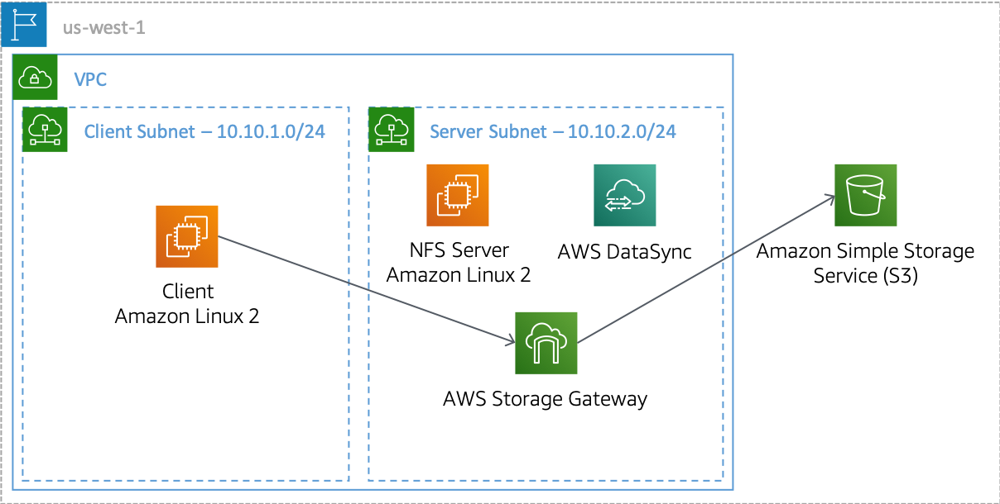

# Migrating 5GB of files and file shares using AWS DataSync and AWS File Gateway

  

## Introduction
Using Terraform to create the architecture, Terraform cloud to store states (Backend file). One-time migration to Amazon S3 from On-Prem to AWS, using DataSync for immediate data transfer, complemented by a continuous backup solution using AWS Storage Gateway's File Gateway for ongoing data protection and archival.

## Architecture
In 2 different Subnets that remains in 2 different AZ (1 for On-Prem Client instance and 2 for AWS Environment). You will find this information on the Architecture Diagram.PNG

### AWS Services
- **Virtual Private Cloud (VPC)**: Configured with 6 subnets spanning 2 different AZs for redundancy and fault tolerance.
- **Subnets**: To Hosts the on-premises instance and Linux AWS instances with the File Gateway mounted.
- **S3**: Acts as the primary storage for migrated files using File Gateway.
- **IAM Roles**: Defines respective roles and policies for all services used, including DataSync, S3, File Gateway, and others.
- **Security Groups**: Secure access for the EC2 instances to HTTP, HTTPS, NFS, SSH AND Port 443 for DataSync.
- **DataSync**: mount the agent and create tasks needed to complete the one-time migration.
- **S3 File Gateway**: for continuous backup after the first migration.
- **EC2**: For the client On-Prem Instance, DataSync Agent, File Gateway Appliance and the Linux Server on AWS environment.
- **Linux**: Shell commands to mount the agents, validate files, bootstraping and more.
- **Scripting**: Scripts to generate the files on directories.

## Additional AWS Components
Firewall with the correct ingress and outbound rules.

## Repository Contents
Here:
- **Code**: Code required in Terraform to create the architecture/ States store in TerraformCloud.
- **Images**: Images with the result of a successful migration, monitoring and results.
- **Scripts**: The Script used to autogenerate Images and files (5GB) to migrate.

## Security
This project has a threat model (STRIDE analysis, attack tree, and severity-ranked findings) — see [docs/threat-model.md](docs/threat-model.md).

https://www.linkedin.com/in/giogalindo470/

