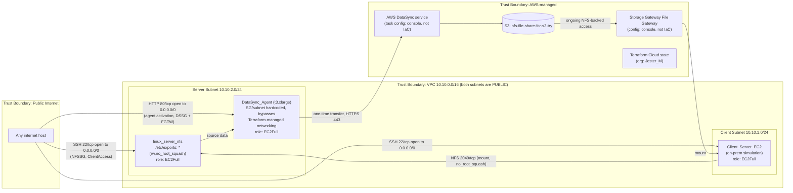
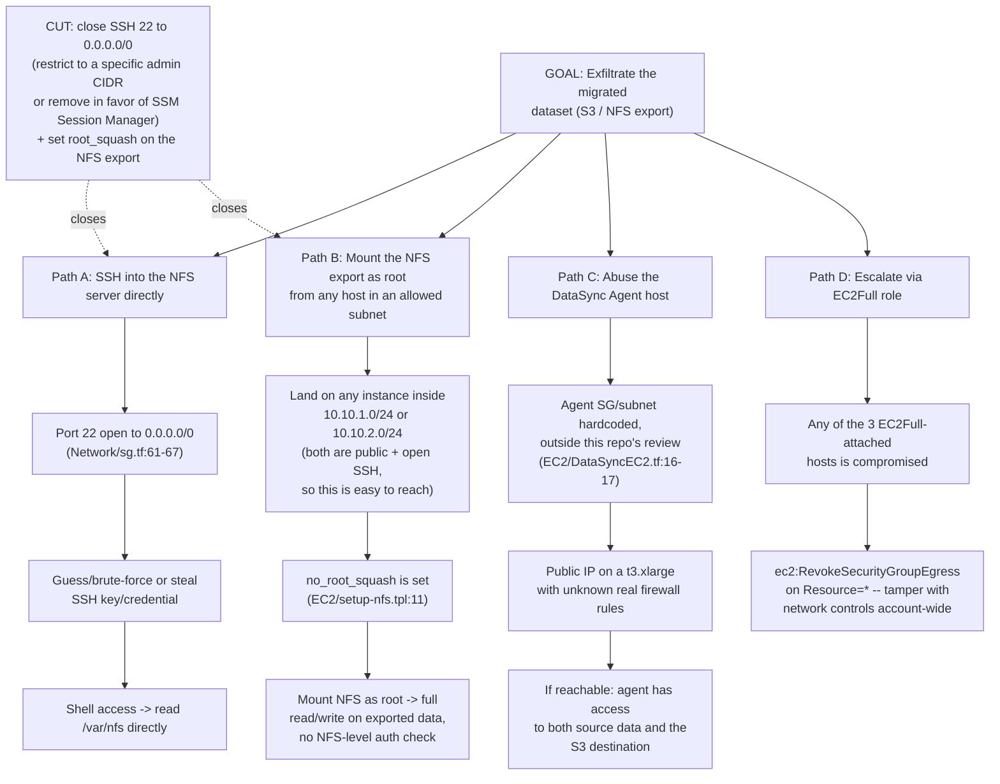

# Threat Model — DataSync / NFS / Storage Gateway Migration

**Status:** lab/portfolio project. **Not a production security assessment.**
**Analyzed from code only** — this stack was **not deployed** for this review (deploying to real AWS would incur cost, per explicit instruction). All findings are derived from static analysis of the Terraform and shell scripts in this repository.

## 1. Scope and system description

This project migrates ~5GB of files from an "on-prem" client (simulated by an EC2 instance) to AWS using AWS DataSync for the one-time transfer, with AWS Storage Gateway (File Gateway) providing ongoing NFS-backed access to S3 afterward. Terraform provisions the VPC/networking, an NFS server EC2 instance, a client EC2 instance, a DataSync Agent EC2 instance, IAM roles, and one S3 bucket. State is stored in Terraform Cloud (`Backend Terraform Cloud`).

In scope: every `.tf`/extensionless Terraform file, the two shell scripts (`auto-generateScript.sh`, `EC2/setup-nfs.tpl`), and `EC2/Bootsrap_Client Instance`.

**Important scope gap found during review:** the repository's name and README promise "AWS DataSync and AWS File Gateway" as the migration mechanism, but the code contains **no `aws_datasync_agent`, `aws_datasync_task`, `aws_datasync_location_*`, or `aws_storagegateway_*` Terraform resources at all**. Only an EC2 instance intended to *host* a self-managed DataSync agent exists (`EC2/DataSyncEC2.tf`) — the actual DataSync task and the Storage Gateway File Gateway configuration were done by hand in the AWS Console (consistent with the screenshots under `AWS Console Image Screenshots/`, e.g. `DataSync Task01_AWS Console.png`). This threat model can only speak to what Terraform actually provisions; the console-configured pieces are undocumented-as-code and therefore unreviewable here.

## 2. Asset inventory (from Terraform code)

| Asset | Resource | Source | Notes |
|---|---|---|---|
| Migrated file data (≤5GB, synthetic `.jpg` blobs per `auto-generateScript.sh`) | `aws_s3_bucket.nfs_file_share` (`nfs-file-share-for-s3-try`) | `S3 Bucket Creation:1-9` | `acl = "private"`; no versioning, encryption, logging, or public-access-block resource |
| Network perimeter | `aws_vpc.VPC_For` (10.10.0.0/16), 2 subnets, 1 IGW, 1 shared public route table | `Network/main.tf:1-74` | Both subnets route to the internet; no private subnet / NAT exists to isolate the data tier |
| NFS server (holds the source dataset before/after transfer) | `aws_instance.linux_server_nfs` | `EC2/main.tf:14-31` | Public subnet, `EC2Full` role attached |
| Simulated on-prem client | `aws_instance.Client_Server_EC2` | `EC2/EC2_Client On-Prem:14-31` | Public subnet, `EC2Full` role attached; `user_data` references `Setup-server.tpl`, which **does not exist** in this repo (only `setup-nfs.tpl` does) |
| DataSync Agent host | `aws_instance.DataSync_Agent` | `EC2/DataSyncEC2.tf:13-30` | `t3.xlarge`, public IP, `EC2Full` role, and points at a security group / subnet **hardcoded by ID** instead of the module's own networking outputs (comment: "Hard coded due to permissions") — bypasses the security groups defined in this repo entirely |
| IAM roles | `EC2Full` (attached to all 3 instances), `S3BucketAccess` (defined, never attached) | `IAM/IAM Roles & Policies`, `IAM/S3 Main Role Policy` | See §4 |
| Security groups | `DSSG`, `NFSSG-SeverAccess`, `ClientAccess`, `FGTW` | `Network/sg.tf` | See §4/§7 |
| Terraform state | Terraform Cloud workspace `DataSync`, org `Jester_M` | `Backend Terraform Cloud:1-9` | State (which can contain resource metadata) lives outside this repo, in Terraform Cloud |

## 3. Data flow diagram

The real trust boundary problem here isn't a missing firewall rule per se — it's that the "server" (data) subnet and "client" subnet are both public, share one route table to the Internet Gateway, and the management port (SSH) on the data-holding host is open to `0.0.0.0/0`. There is no network-level separation between "internet," "client tier," and "data tier."

## 4. IAM inventory and permissions

| Role | Attached to | Policy | Assessment |
|---|---|---|---|
| `EC2Full` | All 3 EC2 instances (`linux_server_nfs`, `Client_Server_EC2`, `DataSync_Agent`) via 3 separate instance profiles | `s3:ListBucket`/`s3:GetObject` scoped to an **unrelated public AWS training bucket** (`arn:aws:s3:::us-west-2-aws-training/...`, `IAM/IAM Roles & Policies:26-43`), plus `s3:HeadBucket` on `*` and **`ec2:RevokeSecurityGroupEgress` on `*`** | Despite the name "EC2Full," this role grants **no access to the project's own bucket** (`nfs-file-share-for-s3-try`) at all — it's leftover from bootstrapping sample data from an AWS Skill Builder training course (`EC2/Bootsrap_Client Instance:5-6` pulls from that exact bucket path). It's attached to every instance including the one running with `t3.xlarge` and a public IP, and grants a wildcard ability to revoke *any* security group's egress rules in the account — an unrelated, unscoped, and unused-for-its-stated-purpose permission |
| `S3BucketAccess` | **Nothing** (defined, never referenced by any instance profile) | `s3:*` on `Resource = "*"` — full S3 admin across the entire account | Dead code today, but a landmine: if anyone ever attaches this (e.g., copy-pasting the pattern used for `EC2Full`), every instance gets full S3 control account-wide |

Net effect: the actual data-plane permissions this migration needs (write to `nfs-file-share-for-s3-try`) are **not represented in Terraform at all** — they must have been granted manually (console) or via the DataSync/Storage Gateway service roles that AWS creates automatically when those services are configured through the console, which is invisible to this repo.

## 5. Shared responsibility by AWS service used

| Service | AWS manages | Customer (this project) manages |
|---|---|---|
| EC2 | Hypervisor, host patching, physical security | Guest OS patching, SSH exposure, IAM instance profile scope (**wide open on both counts — see §7, §4**) |
| VPC / Security Groups | Network fabric availability | Subnet routing, SG rules, public vs. private placement (**both subnets public, SSH open to the internet**) |
| S3 | Durability, availability, infra encryption at rest (default) | Bucket policy, versioning, explicit encryption config, access logging (**none configured**) |
| IAM | Service uptime | Least-privilege authoring (**not least-privilege — see §4**) |
| DataSync / Storage Gateway | Service-side transfer/gateway infrastructure | Task configuration, agent activation security, encryption-in-transit settings (**not visible to this repo — configured out-of-band in the console**) |
| Terraform Cloud | Platform availability, state storage backend | Workspace access control, who can read state containing resource metadata (**not something this repo can audit — org/workspace permissions live in Terraform Cloud itself**) |

## 6. STRIDE — main flow (on-prem client → NFS server → DataSync Agent → S3)

| Threat | Component | Existing control | Gap |
|---|---|---|---|
| **Spoofing** | Client mounting the NFS export | Security group scopes NFS (2049) to specific subnet CIDRs (`Network/sg.tf:44-59`) | NFS itself has no authentication (no Kerberos, no client cert) — any host inside the allowed CIDR is trusted by IP alone |
| **Tampering** | NFS export permissions | None | `no_root_squash` on `/etc/exports` (`EC2/setup-nfs.tpl:11`) means **any client that mounts the export can write as root** — a classic, well-documented NFS misconfiguration |
| **Tampering** | DataSync Agent's network path | None — hardcoded SG/subnet IDs bypass this repo's own security-group definitions | `EC2/DataSyncEC2.tf:16-17`: the actual firewall in front of the highest-value instance (the agent that touches both source data and the AWS transfer path) is **not reviewable from this code** |
| **Repudiation** | Who accessed/modified files via SSH or NFS | None declared | No VPC Flow Logs, no CloudTrail, no OS-level audit logging configured in Terraform or the bootstrap scripts |
| **Information Disclosure** | SSH management access | SG restricts by port only | `0.0.0.0/0` on port 22 for both `NFSSG-SeverAccess` (`Network/sg.tf:61-67`) and `ClientAccess` (`Network/sg.tf:97-103`) — the code's own comments acknowledge this ("Consider restricting this to a specific IP range for security") but ship the open rule anyway |
| **Information Disclosure** | Agent activation over HTTP (not HTTPS) | None | Port 80 open to `0.0.0.0/0` for "agent activation" (`Network/sg.tf:8-14`) and again on the File Gateway SG (`Network/sg.tf:135-141`) — activation traffic is unencrypted and internet-reachable |
| **Denial of Service** | `EC2Full` role's `ec2:RevokeSecurityGroupEgress` on `*` | None | If any of the three instances sharing this role is compromised, an attacker can strip egress rules from *any* security group in the account, not just this project's |
| **Elevation of Privilege** | `S3BucketAccess` role (`s3:*` on `*`) | Currently unattached | Dormant full-account S3 admin permission — a single future `iam_instance_profile` reference away from being live |

## 7. Attack tree — "Steal the migrated data"

**Which control cuts the most branches:** removing the open `0.0.0.0/0` SSH rule (or replacing SSH entirely with AWS Systems Manager Session Manager, which needs no inbound port) closes Path A outright and removes the easiest way to land inside the subnet that Path B depends on. Re-enabling NFS `root_squash` independently closes Path B even if an attacker does land on an allowed host. Together those two changes address the two highest-likelihood paths; Path C stays open regardless because its firewall isn't even in this codebase.

## 8. Findings

| ID | Finding | Severity | Evidence | Risk | Remediation |
|---|---|---|---|---|---|
| F-01 | NFS export configured with `no_root_squash` and no client restriction at the export level | **Critical** | `EC2/setup-nfs.tpl:11` — `/var/nfs *(rw,sync,no_subtree_check,no_root_squash)` | Any client that mounts the share (i.e., anything reachable inside the allowed subnets) gets root-equivalent read/write on all migrated data | Use `root_squash` (default), and scope the export to specific client IPs instead of `*` |
| F-02 | SSH (22/tcp) open to `0.0.0.0/0` on the NFS server and client security groups | **Critical** | `Network/sg.tf:61-67`, `Network/sg.tf:97-103` | Direct internet exposure of shell access to the host holding the source data; the code's own comments admit this should be restricted | Restrict `cidr_blocks` to a known admin range, or replace with SSM Session Manager (no inbound port needed) |
| F-03 | Both subnets are public with a shared route table to the Internet Gateway — no private subnet for the data tier | High | `Network/main.tf:14-35` (both `map_public_ip_on_launch = true`), `Network/main.tf:58-66` (same route table for both) | No network-layer isolation between "client-facing" and "holds the data" tiers; a compromise of either host has the same blast radius | Put the NFS server / DataSync Agent in a private subnet with a NAT gateway for outbound-only internet access |
| F-04 | `EC2Full` IAM role is attached to all three EC2 instances but its actual permissions are unrelated to this project (scoped to a public AWS-training S3 bucket) plus an unscoped `ec2:RevokeSecurityGroupEgress` | High | `IAM/IAM Roles & Policies:19-64`, confirmed by `EC2/Bootsrap_Client Instance:5-6` (same training bucket path) | Misleading role name vs. actual grants; the wildcard `RevokeSecurityGroupEgress` lets a compromised instance strip firewall rules anywhere in the account; the role doesn't even grant the S3 access this migration actually needs, implying real access was set up out-of-band and is unreviewable | Create a purpose-built role per instance scoped to only `nfs-file-share-for-s3-try` and drop the unrelated/wildcard statements |
| F-05 | `S3BucketAccess` IAM role grants `s3:*` on `Resource = "*"` (full-account S3 admin) | High | `IAM/S3 Main Role Policy:18-32` | Currently unattached, so no active exposure, but it's a one-line change away from granting every instance full S3 control over the entire account | Delete it, or scope to the single bucket ARN if it's ever needed |
| F-06 | Agent activation (port 80) exposed to `0.0.0.0/0` instead of using HTTPS/restricted source | Medium | `Network/sg.tf:8-14`, `Network/sg.tf:135-141` | DataSync/File Gateway agent activation traffic is unencrypted and reachable from anywhere | Restrict to a known admin CIDR for the activation window, or tunnel via VPN/Session Manager port forwarding |
| F-07 | DataSync Agent instance bypasses this repo's IaC-managed networking with hardcoded SG/subnet IDs | Medium | `EC2/DataSyncEC2.tf:16-17` (comment: "Hard coded due to permissions") | The firewall in front of the instance with the broadest reach (touches both source data and the transfer path) can't be audited from this codebase at all | Reference `module.networking` outputs like the other two instances do, so the actual rules are reviewable |
| F-08 | The Terraform-described migration mechanism (DataSync/Storage Gateway) doesn't exist as code — it was configured manually in the console | Medium | No `aws_datasync_*` / `aws_storagegateway_*` resources anywhere in the repo; confirmed by `AWS Console Image Screenshots/DataSync Task01_AWS Console.png` etc. | The component that actually performs the data transfer and its encryption-in-transit/at-rest settings are undocumented as code and unreviewable here — this threat model cannot make claims about them | Capture the DataSync task and Storage Gateway config as Terraform (`aws_datasync_task`, `aws_datasync_location_nfs`, `aws_datasync_location_s3`, `aws_storagegateway_gateway`) so it can be reviewed and reproduced |
| F-09 | S3 bucket has no versioning, encryption block, public-access-block, or access logging declared | Medium | `S3 Bucket Creation:1-9` | No protection against accidental public exposure, no audit trail of who read/wrote objects, relies entirely on account defaults | Add `aws_s3_bucket_versioning`, `aws_s3_bucket_server_side_encryption_configuration`, `aws_s3_bucket_public_access_block`, and access logging |
| F-10 | Fake-looking but hardcoded AWS credentials committed directly in `provider.tf` | Low | `provider.tf:12-13` (`access_key = "AKXXXXXXX"`, `secret_key = "jhFXXASDASDADWDEEFWE"`) | These specific values are clearly placeholders, not live keys, but hardcoding credentials in a provider block (instead of environment variables / Terraform Cloud variables / the default credential chain) is a habit that leaks real keys into git history the day someone pastes a real one in by mistake | Remove the `access_key`/`secret_key` arguments entirely and rely on the default AWS credential chain, or Terraform Cloud environment variables |
| F-11 | `Client_Server_EC2` references `Setup-server.tpl`, which does not exist in the repo | Info (code quality, not security) | `EC2/EC2_Client On-Prem:25` vs. actual file `EC2/setup-nfs.tpl` | `terraform plan`/`apply` would fail on this module as committed — noted for completeness since it affects whether this stack is actually deployable as-is | Fix the filename reference or add the missing template |

## 9. Final note

This is a lab/portfolio project built to practice AWS DataSync, Storage Gateway, and Terraform networking/IAM patterns — not a production migration and not handling real customer data. The findings above are written the way they would be for a real assessment (including flagging that the actual DataSync/Storage Gateway configuration lives outside this codebase, in the console) so the exercise is useful practice, but nothing here implies an active production system or a live AWS account currently running this way.
